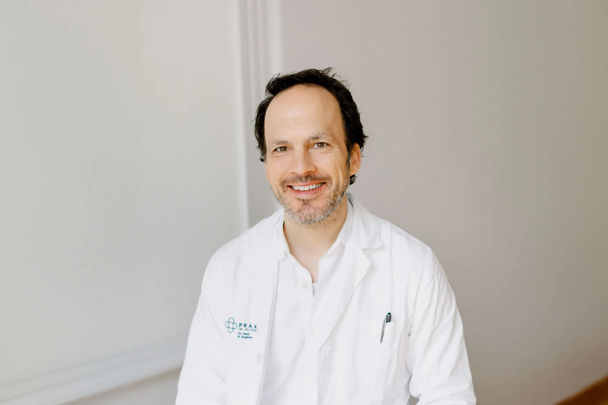

+++
title = "Das Risiko des Lebens"
date = "2024-06-07"
draft = false
pinned = false
tags = ["Deutsch", "Reportage"]
image = "dna-music-augusto-3-.jpg"
footnotes = "**Quellenverzeichnis**\\\nRedakteur unbekannt: Chronische Erkrankungen: <https://www.krankenkasseninfo.de/zahlen-fakten/lexikon/chronische-erkrankung> (abgerufen am 11.03.24)\n\n\nSalome Pflugshaupt: Diabetes Typ 1: [Diabetes Typ 1 - Schweizerische Diabetesgesellschaft (diabetesschweiz.ch) ](https://www.diabetesschweiz.ch/ueber-diabetes/diabetesformen/diabetes-typ-1)(abgerufen am 23.04.24)\n\n\nSalome Pflugshaupt: Diabetes Typ 2: [Diabetes Typ 2 - Schweizerische Diabetesgesellschaft (diabetesschweiz.ch) ](https://www.diabetesschweiz.ch/ueber-diabetes/diabetesformen/diabetes-typ-2)(abgerufen am 23.04.24)\n\n\nDr. Seunggu Han: What are Neurotransmitters: Neurotransmitters: [What they are, functions, and psychology (medicalnewstoday.com](https://www.medicalnewstoday.com/articles/326649)) (abgerufen am 23.04.24)\n\n\nKlaus Frisch: Genetik: [Genetik – Wikipedia](https://de.wikipedia.org/wiki/Genetik) (abgerufen am 29.04.24)\n\n\nFrau Dr. Anja Luise Elfriede Kroke: Primärprävention chronischer Erkrankungen durch Ernährung – von der epidemiologischen Grundlagenforschung zur Formulierung von Empfehlungen: [https://edoc.hu-berlin.de/bitstream/handle/18452/14522/Kroke.pdf (abgerufen am 29.04.24)](https://edoc.hu-berlin.de/bitstream/handle/18452/14522/Kroke.pdf)\n\n\nBundesamt für Statistik: Chronische Krankheit oder langdauerndes gesundheitliches Problem: [https://www.bfs.admin.ch/bfs/de/home/statistiken/gesundheit/gesundheitszustand/allgemeiner.assetdetail.28725088.html](https://edoc.hu-berlin.de/bitstream/handle/18452/14522/Kroke.pdf)  (abgerufen am 28.04.24)\n\n\nFelix Straumann: Sind die Gene an allem schuld: [Sind die Gene an allem schuld? | UZH News | UZH](https://www.news.uzh.ch/de/articles/2004/1494.html) (abgerufen am 01.05.24)\n\n\nFederico Heinz, Dr. Frank Antwerpes, Dr. med. Linnea Mathies: Genetische Prädisposition:  [Genetische Prädisposition - DocCheck Flexikon](https://flexikon.doccheck.com/de/Genetische_Pr%C3%A4disposition#:~:text=Unter%20der%20genetischen%20Pr%C3%A4disposition%2C%20h%C3%A4ufig%20auch%20genetische%20Disposition,bzw.%20Empf%C3%A4nglichkeit%20%28Pr%C3%A4disposition%29%20eines%20Organismus%20f%C3%BCr%20bestimmte%20Erkrankungen.) (abgerufen am 04.05.24)\n\n\n**Bildverzeichnis**\nTitelbild: DNA: Augusto Zambonato: [DNA. Conceptual illustration | Augusto Zambonato](https://augustozambonato.com/work/dna.html) (abgerufen am 07.05.2024)\n\n\nAbbildung 1 und 2: Praxis im Monbijou: Team: [Team (praxis-im-monbijou.ch](https://praxis-im-monbijou.ch/team.html)) (abgerufen am 05.05.24)\n\n\nAbbildung 3: Katalin Pospisek: Ivo Späth (fotografiert am 23.04.24)\n\n\n**Buchverzeichnis**\nBruce Lipton (2010): Biology of Belief, KOHA-Verlag, S.53"
+++
 Welche Rolle spielen unsere Ernährung und Emotionen für unsere Gesundheit? Kann ein schlechter Lebensstil gewisse chronische Krankheiten auslösen? Experten beobachten einen Anstieg an Diagnosen von chronischen Krankheiten. Was kann man selbst dagegen machen? 

von Alice Lettens und Katalin Pospisek

Im belebten Zentrum der Altstadt Bern laufen die Menschen an einem schnell, langsam und rennend vorbei. Von allen Seiten hört man die Geräusche einer Stadt: Das Klingeln der Strassenbahn, Busse und das Gurren der Tauben. Zusammen kreiert es eine wahrlich überwältigende Tonlandschaft. Wenn man hochschaut, sieht man die berühmte Zytglogge mit seinem schönen goldigen Zeiger und seinen Bemalungen. Die grüne Spitze ragt in den Himmel und bringt einen wunderbaren Kontrast zu den roten Dächern der Häuser. Die Zytglogge, das Zentrum der Verwirrung, wo sich alle in eine unterschiedliche Richtung bewegen. Da steht vor der kleinen süssen Apotheke rechts der Zytglogge ein grosser Mann, mit einer Brille und Mütze auf dem Kopf. Ivo Späth, jemand, der schon in seiner Jugend, mit Typ I Diabetes diagnostiziert wurde. Nur wenig weit entfernt steht das majestätische Gebäude der Kornhausbibliothek, wo das Interview stattgefunden hat. Links und rechts reihen sich viele Regale voll Bücher aller Grössen und Farben. Ein belebter Ort für alle, mit Tischen, Sofas und Computer. Hier erzählt Ivo Späth von seinem Leben als Diabetiker Typ 1. 

# Genetik

Die Genetik ist die Wissenschaft der Vererbung. Sie befasst sich mit den Gesetzmässigkeiten und materiellen Grundlagen der Ausbildung von vererblichen Merkmalen und der Weitergabe von Erbanlagen (Genen) an die nächste Generation. Der Bereich ist breit und komplex. Heutzutage weiss man noch zu wenig, um gewisse Grundprinzipien mit Sicherheit zu beschliessen können. Allerdings hat die Wissenschaft viele Fortschritte und Entdeckungen gemacht. Es ist allen bekannt, dass die Genetik z.B. für die Augenfarbe, die Körpergrösse und die Anfälligkeit für Krankheiten verantwortlich ist. Der letztere Fall ist vielleicht das Wichtigste. Es beschreibt, dass wir wegen unserer Genetik krank, gesund oder tot sein können. Aber sind wir wirklich unseren Genen untergeben? Marion Simon, eine Osteopathin aus Delémont, die zwei Jahre Medizin studiert hat, aber dann zu Osteopathie gewechselt hatte, indem sie schon immer interessiert war, widerspricht die verbreitete Überzeugung des genetischen Schicksals. Sie erklärt, es gebe verschiedene Beispiele, wo die Überzeugungen die Gene übergestellt sein könne: Die Prädisposition der Eltern als ihr Kind, nicht in Frage zu stellen und gläubig zu seinem Schicksal laufen. Was heissen möchte, dass obwohl deine Eltern vielleicht eine weitervererbbare Krankheit hatten, dass Sie unter demselben leiden werden. Oder generell der Glaube, den die allermeisten haben, dass man keine Kontrolle über sein eigenes körperliches Schicksal hat. Jeder ist selbst für seine Gesundheit verantwortlich. Diese sind Situationen, die die Gesundheit beeinflussen können. Aber geht sie mit diesen Aussagen zu weit?\
Wie auch Marion Simon, zweifelt der Prof. Albert Schinzel (Genetiker), Prof. Remo Largo (Kinderarzt) und Prof. Daniell Hell (Psychiater), Forscher an dem Institut für Medizinischen Genetik an der Universität Zürich, die Verehrung der Gene. Ihre Forschungen, aus einem Artikel von Felix Straumann im Jahr 2004 geschrieben, beschäftigen sich mit dem Einfluss der Gene auf den Menschen. Sie sind überzeugt, dass die Macht der Gene überschätzt wird, so wie dies vor hundert Jahren schon einmal der Fall gewesen sei. 
Eine wichtige Erkenntnis ist, dass nie nur ein Gen was auslöst. Es sei immer ein komplexes Zusammenspiel zahlreicher Erbfaktoren mit der Umwelt. Das Leben besteht aus unglaublich vielen Umweltfaktoren, welche alle das Diagnostizieren erschweren können. Mit der Brille der genetischen Prädisposition kann man es so beschreiben. Wenn Sie zum Beispiel das Gen für Brustkrebs haben, ist das Risiko dieser Krankheit in späteren Jahren zu bekommen höher. Aber, wenn Sie ein anderes X-Gen (irgendein unbekanntes Gen) besitzen, die das Gen für Brustkrebs entgegenwirkt, kann es sein, dass Sie trotzdem nicht Brustkrebs bekommen. Das Gegenteil ist ebenfalls möglich. Sie haben ein Y-Gen, das bei dem Brustkrebsgen mitwirkt und die Krankheit dadurch verursacht. Es ist nie ein einziges Gen, das etwas auslöst, sondern immer ein Zusammenspiel von mehreren Genen, Genfaktoren und Umweltfaktoren. Das können Dr. Med. Priscilla Dubouloz Eugster, Dr. Med. Roland Eugster, zwei Ärzte der Praxis im Monbijou in Bern, und Marion Simon bestätigen.



Chronische Krankheiten ruhen nicht nur auf die genetische Vererbung, sondern sind ein Ergebnis einer Kombination von genetisch, physiologischen, umweltbedingten und verhaltensbedingten Faktoren.



Also, obwohl Ivo Späths Grossmutter dieselbe Krankheit hatte wie er und womöglich die Gene von ihr vererbt bekommen hat, ist die Signifikanz von mehreren Faktoren immer zu beachten. Ein anderer Faktor, von irgendeiner Art, hat zusätzlich auf diese vererbten Gene mitgewirkt und die Krankheit bei ihm verursacht. Nicht nur seine Grossmutter ist daran schuld.

# «Man ist was man isst»

Dieses Sprichwort hört man oft. Stimmt das aber wirklich? Die Ernährung gehört mit unter zu einem der derzeit bedeutsamsten Risikofaktoren für die Entstehung chronischer Krankheiten. Für die Prävention von Typ 2 Diabetes mellitus3 und Bluthochdruck ist die Ernährung ein besonders nennenswerter Aspekt. Man schätzt, dass bis zu 30% von Krebserkrankungen auf die Ernährung zurückzuführen sind. 2011 lag sogar die Gesamtsterblichkeit in Deutschland von Krankheiten, die Ernährungsbedingt sind, bei 65,1 %. Dazu gehören Krankheiten des Kreislaufsystems, Neubildungen im Körper, Endokrine-, Ernährungs- und Stoffwechselkrankheiten sowie Osteoporose. «Herzkreislauferkrankungen sind etwa für ein Drittel der Todesfälle in der Schweiz verantwortlich und es ist klar, dass diese Erkrankungen durch ungesunde Ernährung negativ beeinflusst werden», erzählt uns Dr. Med. Priscilla Dubouloz Eugster der Monbijou Praxis in Bern. Jedoch finden beide Ärzte, dass es schwer zu sagen wäre, wie gross die Rolle der Ernährung dabei wirklich spielt. Nach dem Bundesamt für Statistik der Schweiz litten 2022 ca. 2.5 Million Schweizer unter einer chronischen Krankheit. Man sieht also chronische Krankheiten sind gar nicht so selten, wie man denken könnte und man beobachtet einen Anstieg in dieser Krankheitsgruppe. 

Für die Zuckerkrankheit ist die Ernährung auch in dieser ein sehr wichtiges Thema. Ivo Späth erzählte wie er vor allem durch seine Jugend eigentlich mit einer strengen Diät lebte, um sein Diabetes nicht negativ zu beeinflussen. Er muss oft Essen, aber darf dabei auch nicht zu viel zu sich nehmen, da sein Blutzucker sonst später zu heftig auf einmal wieder abnimmt und er so in Gefahr kommen kann. Als er älter wurde, begann er aber immer weniger diszipliniert seine Diät zu befolgen, was im Normalfall ging, aber es passierte immer wieder, dass sein Blutzuckerspiegel gefährlich hoch wurde. Ivo Späth wurde als Kind mit Diabetes Mellitus diagnostiziert, somit nahm er den Übergang zum Leben mit einer chronischen Krankheit nicht so schlimm auf, da seine Eltern vieles für ihn übernommen und geschaut haben, dass er seinen Essensplan einhält. Aus diesem Grund findet Ivo Späth auch, dass sein Leben mit einer chronischen Krankheit nicht anders sei. Es ist normal, oder wie Ivo Späth es schildert: 

> «Es ist wie Zähne putzen. Man tut es einfach. Es wird zur Routine im Leben.»

# Emotionen

Emotionen sind sehr vielfältig. Es gibt gute und schlechte, starke und schwache. In dem Fall von ihrem Einfluss auf die Gesundheit, sind eher Emotionen wie Stress oder ein emotionaler Schock zu beachten. Gemeint sind generell schlechte Emotionen, die eine Person langzeitig belasten, welche dann schlussendlich einen negativen Einfluss auf den Körper ausüben können. Die oben erwähnten „Emotionen“ sind Auslöser, die möglicherweise über Jahre hinweg ignoriert oder übersehen wurden und an einem Tag war das Fass überfüllt. Jede Person besitzt eine gewisse Toleranz. Im Leben passieren viele kleinere Sachen und dann eines Tages ist es ein Tropfen zu viel.
Die Ärzte der Praxis im Monbijou stimmen der Idee, dass zum Beispiel viel Stress oder schlechter Schlaf sicher einen ungünstigen Einfluss auf den Lebensstil haben, zu. Und ein ungesunder Lebensstil, beeinflusse wiederum die Gesundheit oder Erkrankungen negativ. Dr. med. Eugster setzt hinzu: «Ich denke, ich würde jetzt nicht sagen, dass so plakativ jemand der depressiv ist oder sehr viel negative Gefühle hat, dass der wegen dem automatisch ein höheres Risiko an Herzkreislauferkrankungen zu erkranken hat, aber wenn man zum Beispiel sehr viel Stress hat und dann eben sehr viel raucht oder Alkohol trinkt, dann ist das sicher ein Risikofaktor für hohen Blutdruck z.B. was wiederum ein Risikofaktor ist für Herzinfarkt. Ich glaube, das führt wie von einem zum anderen.“ Sie erklären, dass die Überzeugungen oder die Gedanken allein reichen nicht eine Krankheit auszulösen.
Eine schlechte Umgebung führt zu negativen Emotionen, welche die Gesundheit gefährden können. Bruce Lipton, ein amerikanischer Biologe im Bereich der Epigenetik, beschrieb in seinem Buch „Biology of Belief“ eins seiner Experimente: Bot er seine Zellen eine gesunde Umgebung an, dann gediehen sie; war die Umgebung nicht optimal, kümmerten sie vor sich hin. Doch sobald er ihre Umgebung dann verbesserte, erholten sich die Zellen. Dies könnte ein Beweis für die Signifikanz des Lebensstils sein, welches wiederum die Umgebung widerspiegelt. 

# Wie können Sie sich helfen?

Ganz generell kann man das einfach beantworten. Achten Sie auf sich. Werden Sie sich bewusst, dass was Sie konsumieren nicht einfach verschwindet ohne jegliche Konsequenzen, auch wenn Sie diese nicht direkt sehen oder spüren können. Schauen Sie, dass Sie nicht zu viel Stress in ihr Leben erlauben, vor allem nicht langfristig. Wie Marion Simon empfehlt: „Vermeide das schnelle Leben.“ Seien Sie sich aber auch bewusst, dass am Ende des Tages nicht alles in ihrer Hand liegt und manches passiert einfach so. Der Körper ist eine komplexe Sache. Man muss sich um sich selbst Sorge heben. Seine Grenzen kennen, aber auch die negativen Begleiterscheinungen ihres Lebensstils erkennen und zu mildern, um möglichst zu probieren Krankheiten vorzubeugen. Chronisch Kranke wie Ivo Späth erkennen zwar die Gefahren in ihrem Alltag durch die Krankheit, aber wissen auch, dass es in Ordnung ist sich auch mal etwas zu erlauben. 

# Begriffserklärung

\
1 : Diabetes Typ I entsteht, wenn die Betazellen der Bauchspeicheldrüse, welche das für die Regulie-rung des Blutzuckers notwendige Insulin herstellen, vom Immunsystem des Körpers zerstört werden. Der Typ-1-Diabetes tritt häufiger bei Kindern und jungen Erwachsenen auf, kann aber Personen in jedem Lebensalter treffen. Diese Personen sind Insulinabhängig.
2: Genetische Prädisposition, häufig auch genetische Disposition genannt, unter dessen versteht man die genetisch, d.h. erblich bedingte Anlage bzw. Empfänglichkeit (Prädisposition) eines Organismus für bestimmte Erkrankungen. Die genetische Prädisposition ist durch die in der DNA kodierten Gene eines Menschen determiniert.
3: Bei Menschen mit Typ-2-Diabetes produziert die Bauchspeicheldrüse zwar weiterhin Insulin, jedoch nicht genügend oder der Körper kann es nicht mehr wirksam verwenden, um Blutzucker in Energie umzuwandeln (Insulinresistenz).